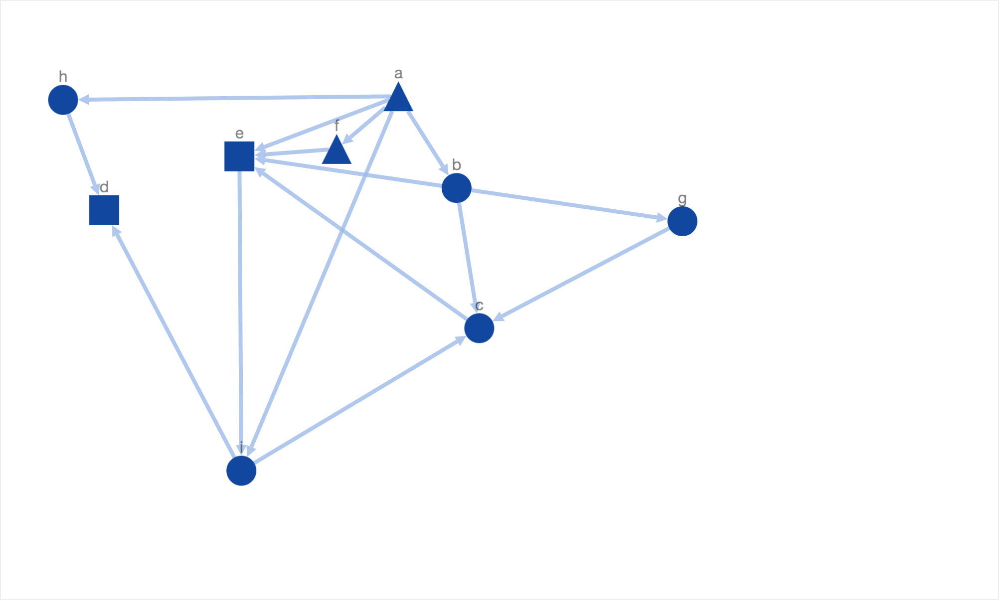
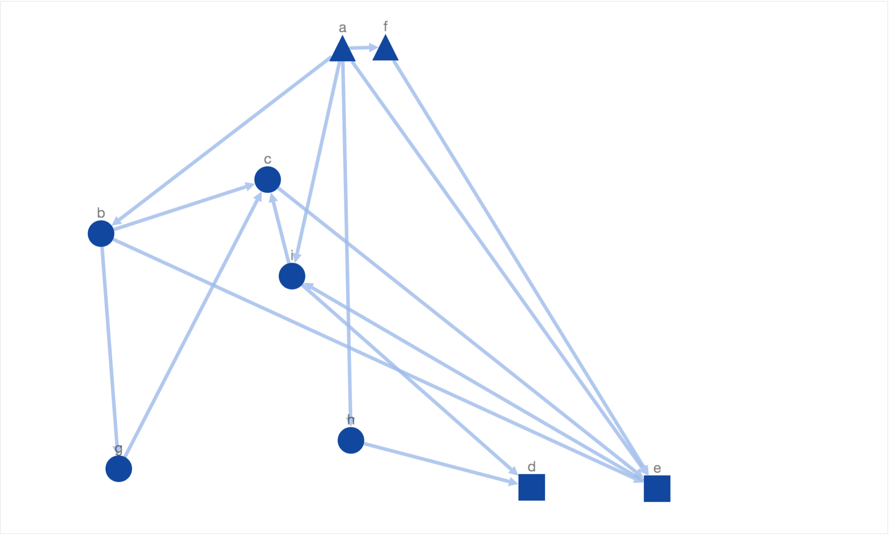
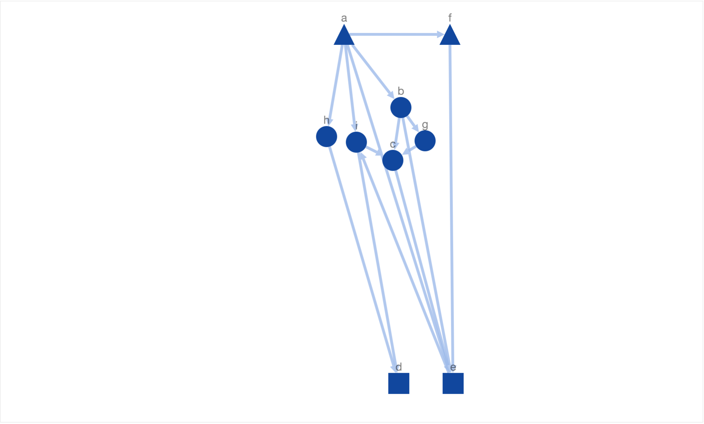
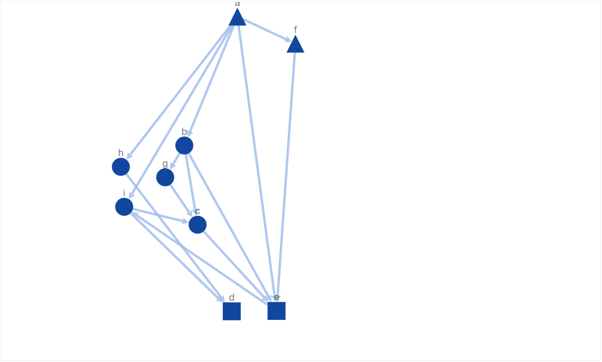

Networks have become ubiquitous in systems biology and visualization is a crucial component in their analysis. In this blog post I am going explore the power of simulated annealing algorithm in laying out PPINs. The algorithm is named after [annealing in metallurgy](https://en.wikipedia.org/wiki/Annealing_(metallurgy)), a technique that involves heating a material above its recrystallization temperature, maintaining a suitable temperature, and then cooling. The Simulated
Annealing (SA) algorithm represents the space of the visualization problem as a set of layouts (states) each one with associated energy, and it tries to find the layout (state) with minimum energy (i.e. below a threshold) that represents a potential network layout. 

Essentially simulated annealing performs the following steps:

- Step 1: Randomly choose an initial layout.
- Step 2: Repeat Step 3 - 4 for fixed number of steps.
- Step 3: Compute a new neighboring (layout) state w.r.t current state (layout). 
- Step 4: If the new state is better than the current state, move to the new state. Otherwise, move to the worse new state with a probability which decreases with temperature.
- Step 5: Decrease the temperature.
- Step 6: If termination rule is satisfied, stop; otherwise go back to Step 2. Possible termination rules are: average change in energy function in one iteration falls below a user-defined threshold or number of iterations exceed maximum number of iterations defined by the user.

The associated energy function can be used to optimize any graph drawing constraint. For example, a common constraint is to decrease the number of edge crossings. [Davidson and Harel]() incorporated the following constraints to draw graphs "nicely".

1. Distribute nodes nicely.
2. Make edge lengths uniform.
3. Minimize edge-crossings.
4. Prevents nodes from coming too close to edges.
5. Keep the nodes inside within the canvas borders.

But these constraints do not cause the resultant layout to mimic the underlying biological knowledge. For instance, in a PPIN where a node represents a protein and an edge represents an interaction or control relationship between two proteins, it
may be important for a layout to reflect the locations of the proteins within the cell, or the communication of a signal from
the exterior of a cell to its nucleus. In this blog, I am going to explore the following constraints which mimic the underlying biological knowledge.

1. Arrange the receptor nodes at the top of the layout.
2. Arrange the transcription factor nodes at the bottom of the layout.
3. Arrange nodes with similar biological properties together.

These constraints capture the intrinsic biological meaning of the networks. Receptor proteins that are located
on the cell membrane, whose function is to sense the presence of the specific signals in the cell’s environment. When a
receptor senses such a signal, it communicates the information to the interior the cell via interactions with other nodes in the network. Ultimately, the signal reaches proteins called transcription factors, which move to the cell’s nucleus to carry out its response to the signal. These constraints utimately seek to convey the flow of information from the cell membrane to the nucleus.

Going ahead, for the purpose of demo, I have used the Cytoscape layout extension - [cytoscape.js-simulated-annealing]() to apply simulated annealing on a given graph. The library allows us to include user defined energy functions and other useful customizations.

In the rest of the blog I will provide a series of examples to demonstrate how simulated annealing can be used to mimic biological constraints mentioned above. First I will give a typical example of nicely drawn graph showcased by [Davidson and Harel](). For the purpose of demostration, I have used a small synthetic network where triangle nodes reperesent receptors, rectangle nodes represent transcription factors and ellipses represent intermediary nodes.

This layout showcases all of the 5 properties of a nice layout defined by [Davidson and Harel](). Although the layout is readable, it doesnt mimic or represent the underlying biological knowledge. For example, there is no clear organization of nodes. The receptors and transcription factors are laid out on same level/height. It is also unclear if the information flow started at intermediary protein node 'a' or receptor node 'h'. There is no consistent sense of direction for information flow as well. The information flow from node 'h' to node  'd' goes from top to bottom in contrast to bottom to top information flow from node 'i' to node 'd'. Therefore, due to the lack of meaningful placement of nodes, the layout is not biologically informative. Inadvertently, the reader has to carefully traverse the graph to understand the flow of information from the cell membrane to the nucleus.

One of the first things we want to do is associate locations to start and end of information flow. To be specific, we want the flow in our layout to start at the top and flow toward the bottom. This requirement can be translated as - "Arrange the receptors at the top" and "Arrange the transcription factors at the bottom". Given the constraint, we added a new energy function defined as following:

where ti, bj stand for the distance between receptor i and the top border and transcription factor j and bottom border respectively. This way the nodes are prevented from getting too far from the respective borderlines. Clearly, the energy function increases if the receptors (triangles) are moved away from top border and transcription factors (rectangles) from bottom border respectively. In order to avoid nodes being moved beyond the borderlines, we set the energy function to a very high value (10i) if the nodes were to be moved beyond top or bottom border. Once we introduced this energy function we were able to see the following resultant layout.

In this layout, simulated annealing has optimized the new constraint of moving receptors (triangles) to the top and transcription factors (rectangles) to the bottom along with the 5 properties of a nice layout defined by [Davidson and Harel](). Due to the introduction of above mentioned constraint, the generated solutions are more biologically meaningful. It is now easier to identify the start and end of information flow without even going through the entire network flow. But at the same time it very hard to discern the sequence of information flow from the placement of intermediary nodes (ellipses). For example, the node 'c' is placed above node 'g' and 'b' when the actual sequence of information flow is a->b->g->c->e. 

In order to get more downward pointing paths, we added another constraint to maximize the number of downward pointing path. We call a path downward pointing, if all directed edges in a path are downward pointing i.e target node is below source node. The energy function used for this constraint is:

The energy function decreases if the number of downward pointing paths increase.  After including the energy function for downward pointing paths, we got the following solution: 

In this solution, we have got more downward pointing paths than the previous solutions. But there few shortcomings. Firstly, the intermediary protein nodes are arranged far from each other. Sometimes in biological networks, one would want to arrange similar nodes (e.g. isoforms) closer. In order to satisfy this constraint, we added an energy function which returns a high value if similar nodes (same shape or color) are placed far from each other. The function is defined as following:

where SameShape(u,v) returns 1 if the u and v have same shape, otherwise 0 and dist(u,v) returns euclidean distance between u and v. After including the above energy function we were able to get the following solution (layout).

In this layout, we have not only reached the maximum number of downward pointing paths but also arranged similar nodes closer to each other. Finally, this layout satisfies the three biological constraints defined earliar in this blog. 

In the above given solution, it is hard to detect if an edge is downward pointing or not at the first look. For example, it his hard to say if node 'a' is above node 'f' or not at the first look. But if we zoom in and take a look at it carefully, we will see that there is a downward pointing edge from node 'a' to 'f'. It would be better we could generate simulated annealing could generate downward pointing paths which are more downward pointing i.e the slope his high or infinity (90o angle or vertical edge). This means we need an energy function which returns a higher value if the average slope of all the edges is low. One possible definition could be as following.

After including the above given energy function, simulated annealing generated the following layout.

